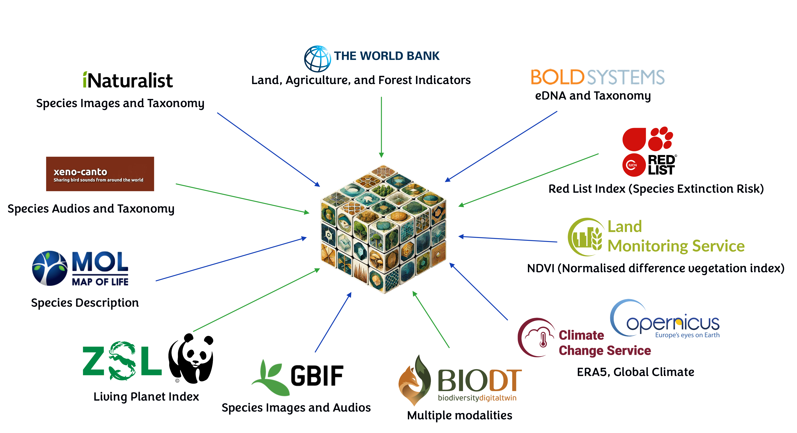
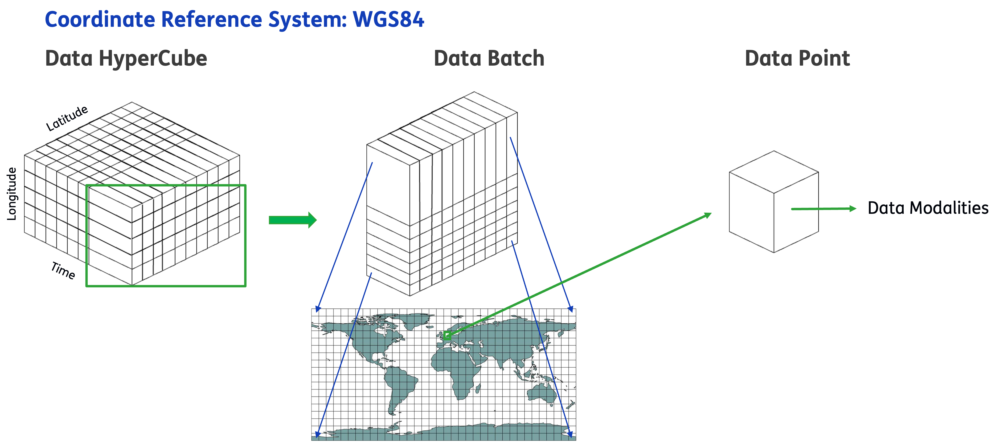

# BioCube: Engineering a Multimodal Dataset for Biodiversity



## Description
This repository contains the code used to engineer **BioCube: A Multimodal Dataset for Biodiversity Research**. The produced dataset, can be found on the [BioCube's Hugging Face](https://huggingface.co/datasets/BioDT/BioCube) page with detailed descriptions of the modalities it contains.


This codebase offers the below core functionalities:
- Download
- Ingestion
- Preprocessing
- File handling & storage
- Dataset creation
- Batch creation

## Getting started

To run the code, to add libraries, and basically to manage the application is done by poetry.

```bash
poetry run run-app      # for running the code
poetry add ...          # for adding dependencies
```

## Download (New) Data

Currently you can download data calling the respective modality-function from the `src/main.py`. We have made the workflow with args, so you can use it without any code changes or run the functions manually from main. The instructions with the params is in the main.


```python
era5(mode = 'range', start_year = '2020', end_year = '2024')
```

## Ingest Data

The relevant scripts can be found at `src/data_ingestion`. Here you can find scripts, to download data from csv files that have been located manually. Running the scripts for example for the indicators for the region or for the world will create a new csv in with the countries, the bounding boxes of each country and the values.

```python
# To proccess all the agriculture files and create new csvs
run_agriculture_data_processing(region = 'Europe', global_mode = False, irrigated = True, arable = True, cropland = True)

# And then to merge them in one file (/data/storage/data/Agriculture/Europe_combined_agriculture_data.csv)
run_agriculture_merging()
```

## Preprocess Data

The scripts for the preprocessing workflows can be found at `src/data_preprocessing`. The script `src/data_preprocessing/preprocessing.py` combines all the preprocessing functions, which then are used to create the species dataset parquet file.

## Create the Dataset

Firstly we have to create the species dataset. Now we dont put all the images and the sounds inside. All the species data are located /data/projects/data/Life. Just run
```python
create_species_dataset(root_folder = /data/projects/data/Life, filepath = /data/projects/processed_data/species_dataset.parquet, start_year: int = 2000, end_year: int = 2020)
```
When we create the species parquet we have all the data for species there. We have the CSVs for the indicators, and red list, ndvi and we are ready to create the data batches.

## Create the Batch

At this point, we can select any kind of modalities and slice them for specific coordinates or timestamps, producing a unified representation we define as **Batch**. The structure is very flexible and easy to use for any kind of downstream task or use case, especially for Foundation Model training. A visualisation is given below.



Creating **Batches** can be done in two settings based on the sampling frequence (daily and monthly) and requires that you have downloaded BioCube and setted up the path variables appropriately. 

### Daily
To create daily Batches, just call the function:

```python
create_dataset(
    species_file="/data/projects/vector_db/species_dataset.parquet",
    era5_directory=paths.ERA5_DIR,
    agriculture_file=paths.AGRICULTURE_COMBINED_FILE,
    land_file=paths.LAND_COMBINED_FILE,
    forest_file=paths.FOREST_FILE,
    species_extinction_file=paths.SPECIES_EXTINCTION_FILE,
    load_type="day-by-day",
)
```

### Monthly

To download BioCube and create monthly Batches, just run the below script:
```bash
bfm_data/dataset_creation/batch_creation/create_batches.sh
```
Or a step-by-step workflow: 
```bash
# First run
python bfm_data/dataset_creation/batch_creation/scan_biocube.py --root biocube_data/data --out catalog_report.parquet
# Then run
python bfm_data/dataset_creation/batch_creation/build_batches_monthly.py
```

You can inspect the created Batches by using the `streamlit run batch_viewer.py --data_dir ./batches` that is located on the same folder as the previous scripts.

To produce statistics from the Batches that can be used for downstream tasks (e.g. normalization), just run `python batch_stats.py --batch_dir batches --out batches_stats.json`

## Storage

`Data` folder contains raw data.

`Dataset_files` contains the csv files from the sources or txt files or json files, that we need them to extract the data and save them to data folder.

`Modality` folders contain txt files which shows which folders contain which modalities. Is produced by command in terminal, run once, there is no code. It should be updated.

`Processed_data` contains labels mapping, timestamps extracted from species dataset. And the species dataset.

## Extra Information
For more detailed information about the workflows settings available, have a look at [documentation](documentation.ipynb).

## License
See [`LICENSE.txt`](LICENSE.txt).


## Acknowledgments
*This study has received funding from the European Union's Horizon Europe research and innovation programme under grant agreement No 101057437 (BioDT project, https://doi.org/10.3030/101057437). Views and opinions expressed are those of the author(s) only and do not necessarily reflect those of the European Union or the European Commission. Neither the European Union nor the European Commission can be held responsible for them.
This publication is part of the project Biodiversity Foundation Model of the research programme Computing Time on National Computing Facilities that is (co-) funded by the Dutch Research Council (NWO). We acknowledge NWO for providing access to Snellius, hosted by SURF through the Computing Time on National Computer Facilities call for proposals.
This work used the Dutch national e-infrastructure with the support of the SURF Cooperative using grant no. EINF-10148*


## Citation 

If you find our work useful, please consider citing us!

```
@article{stasinos2025biocube,
  title={BioCube: A Multimodal Dataset for Biodiversity Research},
  author={Stasinos, Stylianos and Mensio, Martino and Lazovik, Elena and Trantas, Athanasios},
  journal={arXiv preprint arXiv:2505.11568},
  year={2025}
}
```


## Useful commands

Copy files between clusters: cluster_1=a cluster , cluster_2=SURF Snellius

ssh to cluster_1
generate ssh key `ssh-keygen -t ed25519`
copy your public key to https://portal.cua.surf.nl/user/keys `cat ~/.ssh/id_ed25519.pub`
from cluster_1 ssh to cluster_2 to test: `ssh USERNAME@snellius.surf.nl then exit`

```bash
# one of these two, find which one is better / faster
rsync -a --ignore-existing --info=progress2 --info=name0 /data/projects/biodt/storage/ USERNAME@snellius.surf.nl:/projects/data/projects/biodt/storage
rsync -a --update --info=progress2 --info=name0 /data/projects/biodt/storage/ USERNAME@snellius.surf.nl:/projects/data/projects/biodt/storage
```
